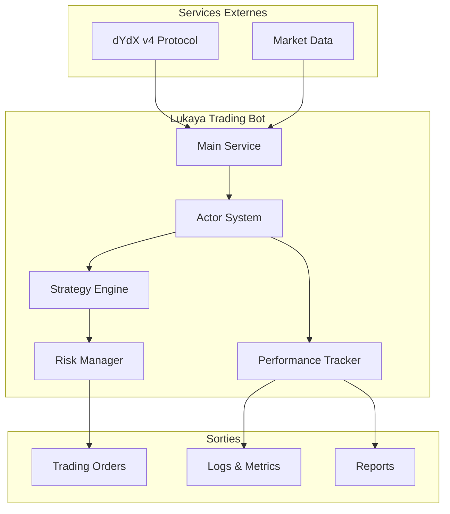
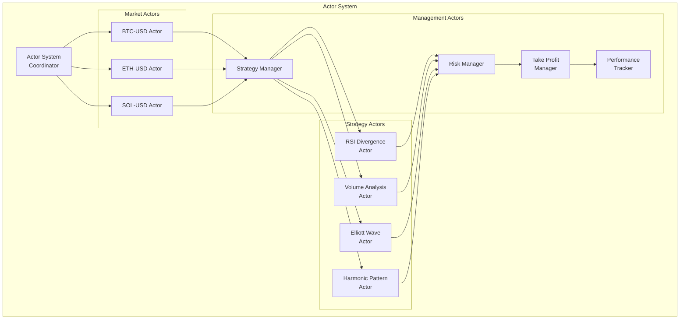
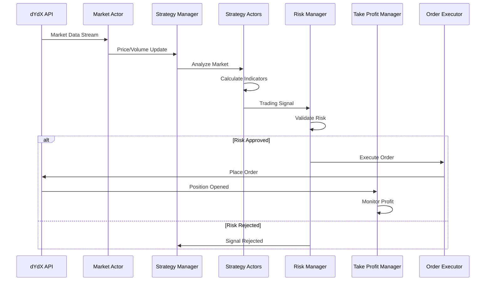
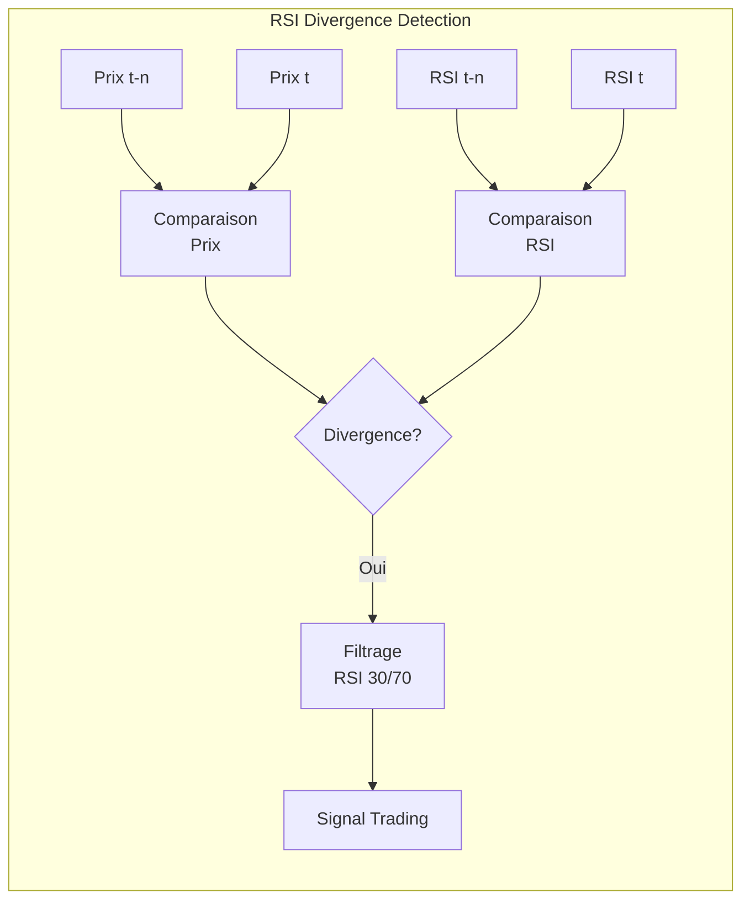
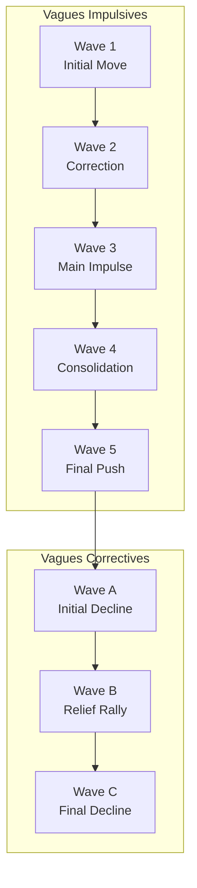
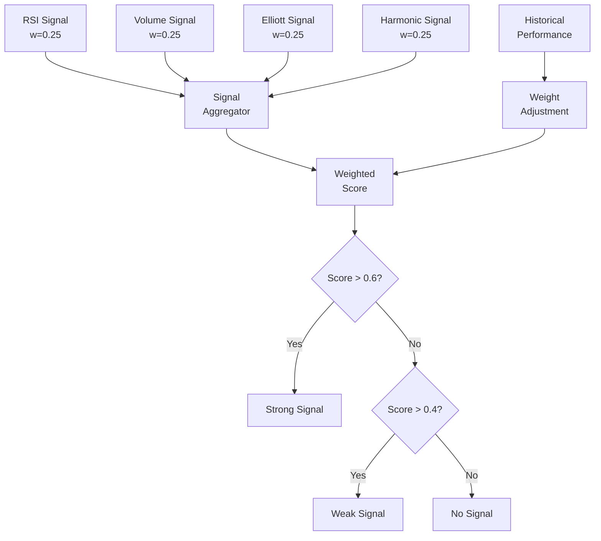
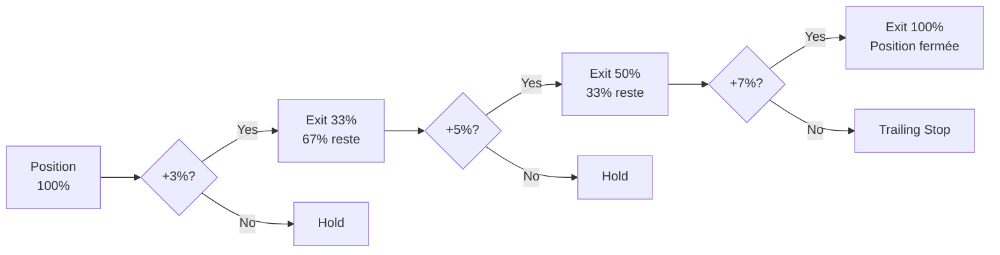

# 📚 Documentation Complète - Lukaya Trading Bot

<div align="center">
  <h1>🤖 LUKAYA</h1>
  <p><strong>Bot de Trading Algorithmique Avancé pour dYdX v4</strong></p>
  <p>
    <a href="#architecture">Architecture</a> •
    <a href="#strategies">Stratégies</a> •
    <a href="#risk-management">Gestion du Risque</a> •
    <a href="#monitoring">Monitoring</a> •
    <a href="#deployment">Déploiement</a>
  </p>
</div>

---

## 📋 Table des Matières

1. [Introduction](#introduction)
2. [Vue d'Ensemble du Système](#vue-densemble)
3. [Architecture Technique](#architecture)
   - [Système d'Acteurs](#système-dacteurs)
   - [Flux de Données](#flux-de-données)
   - [Communication Inter-Acteurs](#communication)
4. [Stratégies de Trading](#strategies)
   - [RSI Divergence](#rsi-divergence)
   - [Volume Analysis](#volume-analysis)
   - [Elliott Wave](#elliott-wave)
   - [Harmonic Patterns](#harmonic-patterns)
   - [Stratégie Coordonnée](#stratégie-coordonnée)
5. [Gestion du Risque](#risk-management)
   - [Position Sizing](#position-sizing)
   - [Stop Loss](#stop-loss)
   - [Take Profit](#take-profit)
6. [Monitoring et Performance](#monitoring)
   - [Métriques](#métriques)
   - [Logs et Alertes](#logs)
   - [Dashboard](#dashboard)
7. [Installation et Configuration](#installation)
8. [Guide de Déploiement](#deployment)
9. [Backtesting](#backtesting)
10. [Dépannage](#troubleshooting)
11. [API Reference](#api-reference)
12. [Glossaire](#glossaire)

---

## 🎯 Introduction {#introduction}

Lukaya est un bot de trading algorithmique sophistiqué conçu spécifiquement pour le protocole dYdX v4. Il utilise une architecture innovante basée sur le modèle d'acteurs et combine plusieurs stratégies d'analyse technique avancées pour détecter et exploiter les opportunités de marché.

### Caractéristiques Principales

- **🏗️ Architecture par Acteurs** : Système modulaire et scalable
- **📊 Multi-Stratégies** : 4 stratégies complémentaires + 1 stratégie coordonnée
- **🛡️ Gestion du Risque Avancée** : Protection multi-niveaux du capital
- **📈 Take Profit Intelligent** : Règle 3-5-7% avec sorties progressives
- **🔍 Monitoring Temps Réel** : Suivi complet des performances
- **⚡ Haute Performance** : Optimisé avec Bun runtime
- **🧪 Backtesting Intégré** : Test et optimisation des stratégies

### Philosophie de Trading

Lukaya suit une approche prudente et méthodique :
- **Préservation du Capital** : Le risque est limité à 1-2% par trade
- **Diversification** : Utilisation de multiples stratégies non corrélées
- **Adaptation** : Ajustement dynamique aux conditions de marché
- **Discipline** : Règles strictes d'entrée et de sortie

---

## 🌐 Vue d'Ensemble du Système {#vue-densemble}

### Diagramme de Contexte



### Composants Principaux

1. **Trading Bot Service** : Orchestrateur principal
2. **Actor System** : Gestion des acteurs et de la communication
3. **Strategy Manager** : Coordination des stratégies
4. **Risk Manager** : Validation et gestion du risque
5. **Take Profit Manager** : Gestion des sorties progressives
6. **Performance Tracker** : Monitoring et métriques

---

## 🏗️ Architecture Technique {#architecture}

### Système d'Acteurs {#système-dacteurs}

L'architecture de Lukaya est basée sur le modèle d'acteurs, offrant :
- **Isolation** : Chaque acteur a son propre état
- **Concurrence** : Traitement parallèle des messages
- **Résilience** : Supervision et redémarrage automatique
- **Scalabilité** : Ajout facile de nouveaux acteurs

#### Diagramme des Acteurs



### Flux de Données {#flux-de-données}

#### Séquence de Trading



### Communication Inter-Acteurs {#communication}

Les acteurs communiquent via un système de messages typés :

```typescript
interface ActorMessage {
  type: string;
  payload: any;
  timestamp: number;
  correlationId?: string;
}
```

#### Types de Messages

- **MarketUpdate** : Données de marché en temps réel
- **StrategySignal** : Signal de trading d'une stratégie
- **RiskCheck** : Demande de validation du risque
- **OrderRequest** : Demande d'exécution d'ordre
- **PerformanceUpdate** : Mise à jour des métriques

---

## 📊 Stratégies de Trading {#strategies}

### RSI Divergence {#rsi-divergence}

#### Principe
Détecte les divergences entre le prix et l'indicateur RSI pour anticiper les retournements.

#### Diagramme de Fonctionnement



#### Paramètres
- **RSI Period** : 14 (par défaut)
- **Overbought** : 70
- **Oversold** : 30
- **Lookback** : 20 bougies

### Volume Analysis {#volume-analysis}

#### Principe
Analyse les anomalies de volume pour détecter l'intérêt institutionnel.

#### Indicateurs Utilisés
- Volume/MA Ratio
- Delta Volume (Buy vs Sell)
- Corrélation Prix-Volume

### Elliott Wave {#elliott-wave}

#### Structure des Vagues



### Harmonic Patterns {#harmonic-patterns}

#### Patterns Détectés

| Pattern | XA | AB | BC | CD | Success Rate |
|---------|----|----|----|----|--------------|
| Gartley | 0.618 | 0.382-0.886 | 1.13-1.618 | 0.786 | 85% |
| Butterfly | 0.786 | 0.382-0.886 | 1.618-2.24 | 1.27-1.618 | 83% |
| Bat | 0.382-0.5 | 0.382-0.886 | 1.618-2.618 | 0.886 | 87% |
| Crab | 0.382-0.618 | 0.382-0.886 | 2.618-3.618 | 1.618 | 89% |

### Stratégie Coordonnée {#stratégie-coordonnée}

La stratégie coordonnée combine les signaux des 4 stratégies avec un système de pondération adaptatif.

#### Algorithme de Pondération



---

## 🛡️ Gestion du Risque {#risk-management}

### Position Sizing {#position-sizing}

#### Formule de Kelly Modifiée

```
Position Size = (Kelly Fraction × Capital × Confidence) / Leverage
```

Où :
- **Kelly Fraction** : 0.25 (Kelly conservateur)
- **Confidence** : Score de la stratégie (0-1)
- **Leverage** : Maximum 2x

### Stop Loss {#stop-loss}

#### Types de Stop Loss

1. **Fixed Stop** : 2% par défaut
2. **ATR Stop** : 2 × ATR(14)
3. **Structure Stop** : Support/Résistance
4. **Time Stop** : Fermeture après X heures

### Take Profit Strategy {#take-profit}

#### Règle 3-5-7%



---

## 📈 Monitoring et Performance {#monitoring}

### Métriques Clés {#métriques}

#### Dashboard Principal

```
┌─────────────────────────────────────────────────────────┐
│                  LUKAYA DASHBOARD                       │
├─────────────────┬───────────────┬───────────────────────┤
│ Account Value   │ P&L Today     │ Open Positions        │
│ $10,523.45     │ +$234.56      │ 3                     │
│ ▲ 5.23%        │ ▲ 2.28%       │ BTC, ETH, SOL         │
├─────────────────┴───────────────┴───────────────────────┤
│                    PERFORMANCE METRICS                   │
├─────────────────┬───────────────┬───────────────────────┤
│ Win Rate        │ Profit Factor │ Sharpe Ratio          │
│ 68.5%          │ 2.34          │ 1.87                  │
├─────────────────┼───────────────┼───────────────────────┤
│ Avg Win         │ Avg Loss      │ Max Drawdown          │
│ +3.45%         │ -1.23%        │ -8.34%                │
├─────────────────┴───────────────┴───────────────────────┤
│                  STRATEGY PERFORMANCE                    │
├─────────────────┬───────────────┬───────────────────────┤
│ RSI Divergence  │ 72% WR        │ +$1,234               │
│ Volume Analysis │ 65% WR        │ +$987                 │
│ Elliott Wave    │ 70% WR        │ +$1,456               │
│ Harmonic        │ 74% WR        │ +$1,678               │
└─────────────────┴───────────────┴───────────────────────┘
```

### Système de Logs {#logs}

#### Niveaux de Log avec Emojis

- 🚀 **START** : Démarrage du système
- 📊 **SIGNAL** : Signal de trading détecté
- ✅ **TRADE** : Trade exécuté
- 💰 **PROFIT** : Take profit déclenché
- 🛑 **STOP** : Stop loss déclenché
- ⚠️ **WARNING** : Avertissement
- ❌ **ERROR** : Erreur système
- 📈 **METRICS** : Mise à jour des métriques

### Dashboard Temps Réel {#dashboard}

Le dashboard web (optionnel) affiche :
- État des positions en temps réel
- Graphiques de performance
- Historique des trades
- Métriques par stratégie
- Alertes et notifications

---

## 🚀 Installation et Configuration {#installation}

### Prérequis

- Node.js 18+ ou Bun 1.0+
- Compte dYdX v4
- 1GB RAM minimum
- Connection internet stable

### Installation

```bash
# Cloner le repository
git clone https://github.com/your-repo/lukaya.git
cd lukaya

# Installer les dépendances
bun install

# Copier le fichier de configuration
cp .env.example .env

# Éditer la configuration
nano .env
```

### Configuration Minimale

```env
# dYdX Configuration
DYDX_MNEMONIC="your twelve word mnemonic phrase here"
DYDX_NETWORK="mainnet"

# Trading Configuration
DEFAULT_SYMBOLS="BTC-USD,ETH-USD"
DEFAULT_POSITION_SIZE=0.01
STOP_LOSS_PERCENT=0.02

# Strategy Selection
STRATEGY="coordinated"
```

### Vérification

```bash
# Lancer les tests
bun test

# Vérifier la connexion
bun run src/examples/check-connection.ts
```

---

## 🌐 Guide de Déploiement {#deployment}

### Déploiement Local

```bash
# Build
bun run build

# Lancer en production
bun start
```

### Déploiement Cloud (Recommandé)

#### Option 1: VPS (DigitalOcean, AWS, etc.)

```bash
# Se connecter au serveur
ssh user@your-server

# Installer les dépendances
curl -fsSL https://bun.sh/install | bash
git clone your-repo

# Configurer systemd
sudo nano /etc/systemd/system/lukaya.service
```

#### Service Systemd

```ini
[Unit]
Description=Lukaya Trading Bot
After=network.target

[Service]
Type=simple
User=lukaya
WorkingDirectory=/home/lukaya/bot
ExecStart=/home/lukaya/.bun/bin/bun run start
Restart=always
RestartSec=10

[Install]
WantedBy=multi-user.target
```

#### Option 2: Docker

```dockerfile
FROM oven/bun:1.0-alpine
WORKDIR /app
COPY package.json bun.lockb ./
RUN bun install --frozen-lockfile
COPY . .
RUN bun run build
CMD ["bun", "start"]
```

### Monitoring en Production

- **Logs** : Utiliser un aggregateur (ELK, Datadog)
- **Métriques** : Exporter vers Prometheus/Grafana
- **Alertes** : Configurer des webhooks Discord/Telegram
- **Backup** : Sauvegarder les logs et l'état

---

## 🧪 Backtesting {#backtesting}

### Lancer un Backtest

```bash
# Backtest simple
bun run backtest

# Avec paramètres personnalisés
bun run backtest -- --symbol=BTC-USD --from=2024-01-01 --strategy=rsi

# Optimisation des paramètres
bun run backtest -- --optimize --generations=50
```

### Résultats du Backtest

```
📊 Backtest Results - BTC-USD
Period: 2024-01-01 to 2024-03-01
Strategy: Coordinated Multi-Strategy

Performance Metrics:
- Total Return: +23.45%
- Sharpe Ratio: 2.13
- Max Drawdown: -5.67%
- Win Rate: 71.2%
- Total Trades: 143

Best Parameters Found:
- RSI Period: 16
- Volume Threshold: 1.8
- Stop Loss: 1.8%
- Take Profit: [3%, 5%, 8%]
```

---

## 🔧 Dépannage {#troubleshooting}

### Problèmes Courants

#### 1. Connection Error
```
❌ Error: Cannot connect to dYdX
```
**Solution** : Vérifier DYDX_NETWORK et la connexion internet

#### 2. Insufficient Balance
```
⚠️ Warning: Insufficient balance for trade
```
**Solution** : Vérifier le solde ou réduire POSITION_SIZE

#### 3. Rate Limit
```
⚠️ Warning: Rate limit exceeded
```
**Solution** : Le bot gère automatiquement, attendre 60s

### Logs de Diagnostic

```bash
# Voir les logs en temps réel
tail -f logs/lukaya.log

# Filtrer par niveau
grep "ERROR" logs/lukaya.log

# Analyser les performances
grep "METRICS" logs/lukaya.log | tail -100
```

---

## 📖 API Reference {#api-reference}

### Core Classes

#### TradingBotService
```typescript
class TradingBotService {
  constructor(config: BotConfig)
  start(): Promise<void>
  stop(): Promise<void>
  getStatus(): BotStatus
}
```

#### Actor
```typescript
abstract class Actor<T> {
  abstract receive(message: T): Promise<void>
  send(to: ActorRef, message: any): void
  subscribe(event: string, handler: Function): void
}
```

#### Strategy
```typescript
interface Strategy {
  name: string
  analyze(market: MarketData): Promise<Signal>
  getParameters(): StrategyParams
}
```

### Message Types

```typescript
// Market Update
interface MarketUpdate {
  symbol: string
  price: number
  volume: number
  timestamp: number
}

// Trading Signal
interface TradingSignal {
  symbol: string
  side: 'BUY' | 'SELL'
  confidence: number
  strategy: string
  reason: string
}

// Risk Decision
interface RiskDecision {
  approved: boolean
  adjustedSize?: number
  reason?: string
}
```

---

## 📚 Glossaire {#glossaire}

| Terme | Définition |
|-------|------------|
| **Actor** | Unité de calcul isolée qui communique par messages |
| **ATR** | Average True Range - mesure de volatilité |
| **Divergence** | Écart entre l'évolution du prix et d'un indicateur |
| **Elliott Wave** | Théorie des vagues de marché en 8 phases |
| **Fibonacci** | Ratios mathématiques utilisés en analyse technique |
| **Harmonic Pattern** | Structures géométriques basées sur Fibonacci |
| **Kelly Criterion** | Formule de dimensionnement optimal des positions |
| **RSI** | Relative Strength Index - indicateur de momentum |
| **Sharpe Ratio** | Mesure du rendement ajusté au risque |
| **Slippage** | Différence entre prix attendu et prix d'exécution |
| **Take Profit** | Ordre de fermeture automatique en profit |
| **Win Rate** | Pourcentage de trades gagnants |

---

## 🤝 Contribution

Les contributions sont bienvenues ! Voir [CONTRIBUTING.md](../CONTRIBUTING.md) pour les guidelines.

## 📄 License

Ce projet est sous license MIT. Voir [LICENSE](../LICENSE) pour plus de détails.

---

<div align="center">
  <p><strong>Bon trading avec Lukaya ! 🚀</strong></p>
  <p>Pour toute question, consultez la FAQ ou ouvrez une issue sur GitHub.</p>
</div>
