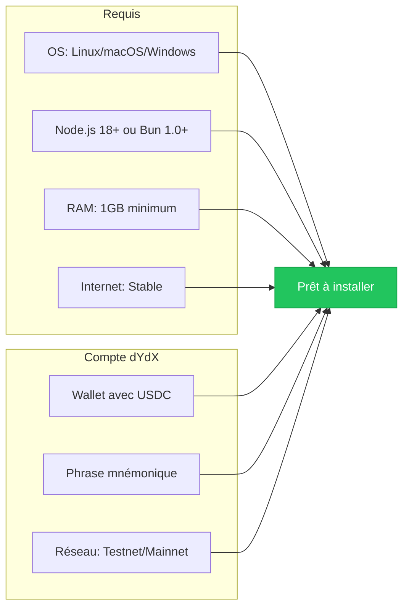
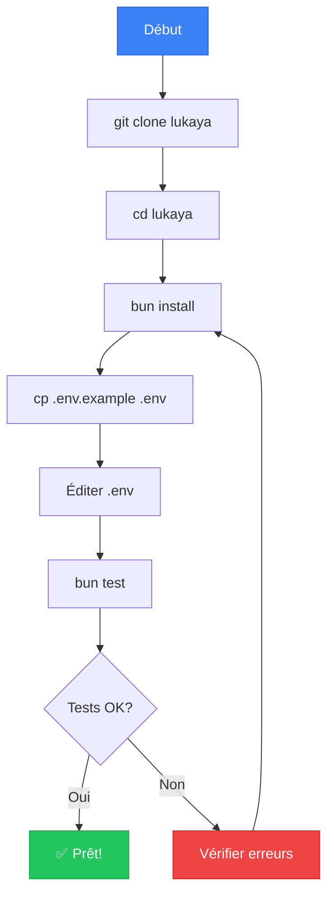
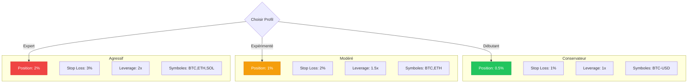
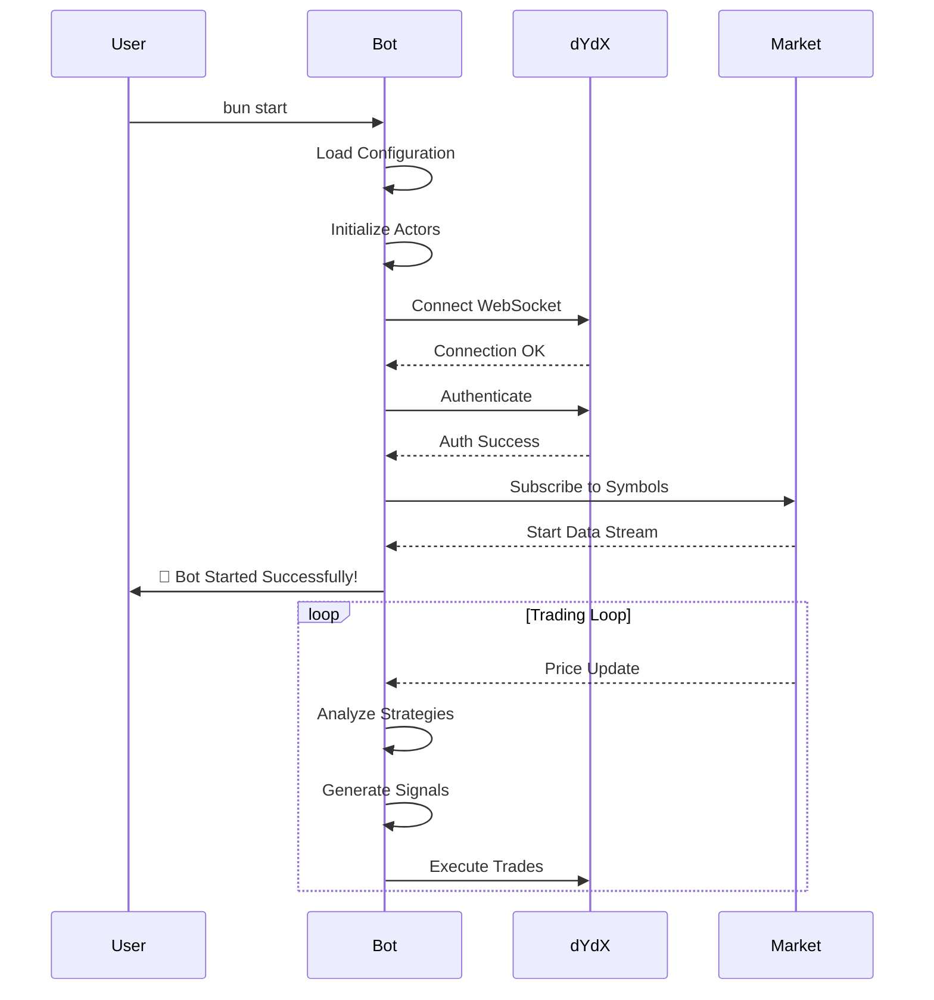
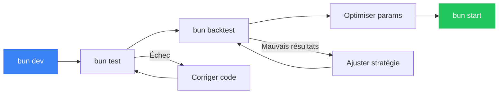
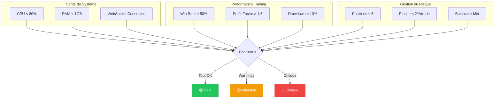
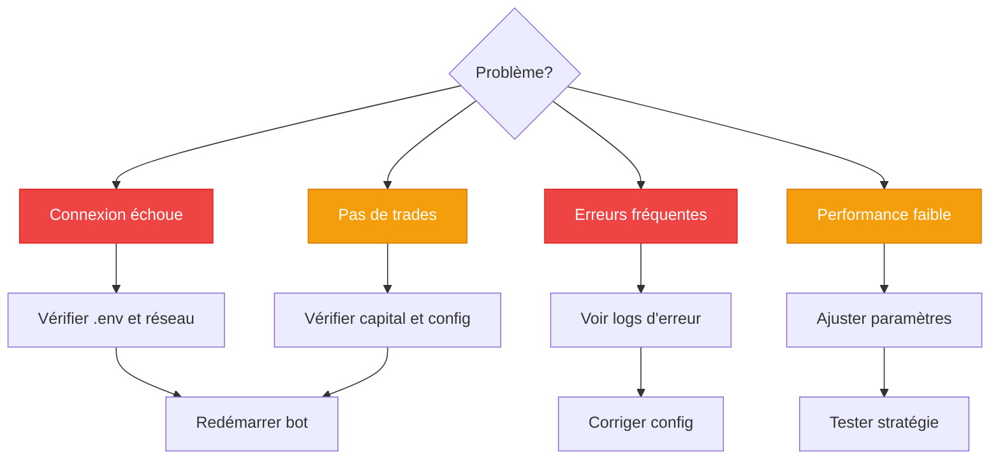

# 🚀 Guide de Démarrage Rapide - Lukaya Trading Bot

Ce guide vous permettra de démarrer rapidement avec Lukaya en moins de 10 minutes.

## 📋 Sommaire

1. [Prérequis](#prerequis)
2. [Installation Rapide](#installation-rapide)
3. [Configuration Minimale](#configuration-minimale)
4. [Premier Démarrage](#premier-demarrage)
5. [Commandes Essentielles](#commandes-essentielles)
6. [Surveillance du Bot](#surveillance)
7. [Dépannage Rapide](#depannage)

---

## 1. Prérequis {#prerequis}

### Configuration Système Minimale



### Checklist Pré-Installation

- [ ] Bun ou Node.js installé
- [ ] Git installé
- [ ] Compte dYdX créé
- [ ] Phrase mnémonique sauvegardée
- [ ] Au moins 100 USDC sur le compte (mainnet)

---

## 2. Installation Rapide {#installation-rapide}

### Étapes d'Installation

```bash
# 1. Cloner le projet
git clone https://github.com/your-repo/lukaya.git
cd lukaya

# 2. Installer les dépendances
bun install
# ou avec npm: npm install

# 3. Copier la configuration
cp .env.example .env

# 4. Vérifier l'installation
bun test
```

### Diagramme d'Installation



---

## 3. Configuration Minimale {#configuration-minimale}

### Fichier .env Essentiel

```env
# 🔐 OBLIGATOIRE - Connexion dYdX
DYDX_MNEMONIC="your twelve word mnemonic phrase goes here"
DYDX_NETWORK="testnet"  # ou "mainnet" pour production

# 📊 Configuration de Trading
DEFAULT_SYMBOLS="BTC-USD,ETH-USD"  # Symboles à trader
DEFAULT_POSITION_SIZE=0.01          # 1% du capital par trade
STOP_LOSS_PERCENT=0.02              # Stop loss à 2%

# 🎯 Stratégie (Recommandé: coordinated)
STRATEGY="coordinated"              # Utilise toutes les stratégies

# 💰 Capital et Risque
DEFAULT_ACCOUNT_SIZE=1000           # Capital en USD
RISK_PER_TRADE=0.01                 # 1% de risque max
```

### Configuration Rapide par Profil



---

## 4. Premier Démarrage {#premier-demarrage}

### Commandes de Démarrage

```bash
# 1. Vérifier la connexion
bun run src/examples/check-connection.ts

# 2. Démarrer en mode développement (recommandé pour débuter)
bun dev

# 3. Démarrer en production
bun start
```

### Flux de Démarrage



### Logs de Démarrage Normal

```
🚀 Starting Lukaya Trading Bot v1.0.0
📡 Connecting to dYdX testnet...
✅ Connected successfully
🔐 Authenticating...
✅ Authentication successful
💰 Account balance: $1,000.00 USDC
📊 Subscribing to BTC-USD, ETH-USD
🎯 Strategy: Coordinated Multi-Strategy
✅ All systems operational
🤖 Bot is now trading!
```

---

## 5. Commandes Essentielles {#commandes-essentielles}

### Tableau des Commandes

| Commande | Description | Utilisation |
|----------|-------------|-------------|
| `bun dev` | Mode développement | Tests et debug |
| `bun start` | Mode production | Trading réel |
| `bun test` | Lancer les tests | Vérification |
| `bun run backtest` | Backtesting | Test stratégies |
| `bun test:quick` | Tests rapides | Validation rapide |

### Workflow de Développement



---

## 6. Surveillance du Bot {#surveillance}

### Dashboard en Console

```
┌─────────────────────────────────────────────────┐
│           LUKAYA TRADING BOT - LIVE             │
├─────────────────────────────────────────────────┤
│ Status: 🟢 RUNNING | Uptime: 2h 34m 12s        │
├─────────────────────────────────────────────────┤
│ Account Balance: $1,054.32 (+5.43%)             │
│ Open Positions: 2/5                             │
├─────────────────────────────────────────────────┤
│ Today's P&L: +$54.32 (+5.43%)                  │
│ Win Rate: 68% (17W / 8L)                        │
├─────────────────────────────────────────────────┤
│ Active Positions:                               │
│ • BTC-USD LONG +2.34% (TP1 hit)                │
│ • ETH-USD LONG +0.87%                          │
├─────────────────────────────────────────────────┤
│ Recent Signals:                                 │
│ • 14:32 RSI Divergence on SOL-USD (Rejected)   │
│ • 14:28 Volume Spike on ETH-USD (Executed)     │
│ • 14:15 Harmonic Pattern on BTC-USD (Executed) │
└─────────────────────────────────────────────────┘
```

### Indicateurs Clés à Surveiller



### Fichiers de Logs

```bash
# Logs principaux
tail -f logs/lukaya.log

# Filtrer par niveau
grep "ERROR" logs/lukaya.log
grep "TRADE" logs/lukaya.log
grep "PROFIT" logs/lukaya.log

# Suivre les performances
grep "METRICS" logs/lukaya.log | tail -20
```

---

## 7. Dépannage Rapide {#depannage}

### Problèmes Fréquents et Solutions



### Commandes de Diagnostic

```bash
# Vérifier la connexion
bun run src/examples/check-connection.ts

# Tester une stratégie spécifique
STRATEGY=rsi bun dev

# Mode debug verbose
DEBUG=* bun dev

# Nettoyer et réinstaller
rm -rf node_modules bun.lockb
bun install
```

### Messages d'Erreur Courants

| Erreur | Cause | Solution |
|--------|-------|----------|
| `ECONNREFUSED` | Pas de connexion | Vérifier internet/firewall |
| `Invalid mnemonic` | Mauvaise phrase | Vérifier .env |
| `Insufficient balance` | Pas assez d'USDC | Ajouter des fonds |
| `Rate limit exceeded` | Trop de requêtes | Attendre 60s |

---

## 🎉 Prochaines Étapes

### Une fois le bot démarré avec succès :

1. **Observer** : Laissez tourner 1-2 heures en mode dev
2. **Analyser** : Consultez les logs et métriques
3. **Optimiser** : Ajustez les paramètres si nécessaire
4. **Backtester** : Testez sur données historiques
5. **Production** : Passez en mainnet quand prêt

### Ressources Utiles

- 📚 [Documentation Complète](./DOCUMENTATION_COMPLETE.md)
- 🏗️ [Architecture Détaillée](./diagrams/ARCHITECTURE_DIAGRAMS.md)
- 📈 [Guide des Stratégies](./STRATEGIES_GUIDE.md)
- 🛡️ [Gestion du Risque](./RISK_MANAGEMENT.md)

---

## 📞 Support

Si vous rencontrez des problèmes :

1. Consultez les [logs détaillés](#surveillance)
2. Vérifiez la [FAQ](./FAQ.md)
3. Ouvrez une issue sur GitHub
4. Rejoignez notre Discord

---

**Bon trading avec Lukaya ! 🚀**

*Ce guide est conçu pour un démarrage rapide. Pour une utilisation avancée, consultez la documentation complète.*
