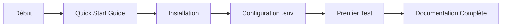
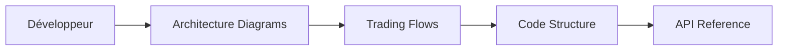
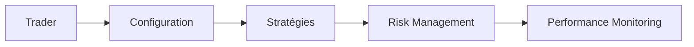

# 📚 Documentation Lukaya Trading Bot

Bienvenue dans la documentation complète du bot de trading algorithmique Lukaya pour dYdX v4.

## 🎯 Navigation Rapide

### Pour Commencer
- 🚀 [Guide de Démarrage Rapide](./QUICK_START_GUIDE.md) - Démarrez en moins de 10 minutes
- 📖 [Documentation Complète](./DOCUMENTATION_COMPLETE.md) - Guide exhaustif du système
- 📋 [Installation et Configuration](../README.md) - Instructions détaillées d'installation

### Architecture et Diagrammes
- 🏗️ [Diagrammes d'Architecture](./diagrams/ARCHITECTURE_DIAGRAMS.md) - Vue complète de l'architecture système
- 📈 [Diagrammes de Flux Trading](./diagrams/TRADING_FLOWS.md) - Flux détaillés des processus de trading
- 🔄 [Architecture Technique](../SCHEMA_ARCHITECTURE.md) - Schéma architectural original

### Guides Spécialisés
- 📊 [Gestion des Positions](../SUIVI_POSITIONS_OUVERTES.md) - Cycle de vie complet des positions
- 🚦 [Solution Rate Limiting](../RATE_LIMITING_SOLUTION.md) - Gestion avancée des limites API
- 🔄 [Migration Enhanced Client](../MIGRATION_ENHANCED_CLIENT.md) - Guide de migration du client

### Historique et Suivi
- 📝 [Changelog](../CHANGELOG.md) - Historique des versions et nouveautés
- 🐛 [Résolution des Problèmes](../RESOLUTION_EXCEEDED_LIMIT.md) - Solutions aux problèmes courants

## 📂 Structure de la Documentation

```
lukaya/docs/
├── README.md                        # Ce fichier - Point d'entrée
├── DOCUMENTATION_COMPLETE.md        # Documentation exhaustive avec TOC
├── QUICK_START_GUIDE.md            # Guide de démarrage rapide
└── diagrams/                       # Tous les diagrammes
    ├── ARCHITECTURE_DIAGRAMS.md    # Diagrammes d'architecture
    └── TRADING_FLOWS.md           # Flux de trading détaillés
```

## 🗺️ Plan de Navigation

### 1. Nouveaux Utilisateurs


### 2. Développeurs


### 3. Traders


## 📊 Contenu par Section

### Documentation Complète
- Introduction et philosophie
- Architecture technique détaillée
- Guide complet des stratégies
- Gestion du risque avancée
- Monitoring et performance
- Installation et déploiement
- Backtesting
- API Reference
- Glossaire complet

### Diagrammes d'Architecture
- Vue d'ensemble du système (C4)
- Architecture des composants
- Système d'acteurs
- Communication inter-acteurs
- Flux de données
- Architecture de déploiement

### Diagrammes de Trading
- Flux principal de trading
- Analyse de marché
- Génération de signaux
- Processus de décision
- Exécution d'ordres
- Gestion des positions
- Take profit strategy
- Gestion des erreurs

## 🔍 Recherche Rapide

| Je veux... | Document | Section |
|------------|----------|---------|
| Installer le bot | [Quick Start Guide](./QUICK_START_GUIDE.md) | Installation Rapide |
| Comprendre l'architecture | [Architecture Diagrams](./diagrams/ARCHITECTURE_DIAGRAMS.md) | Vue d'Ensemble |
| Configurer les stratégies | [Documentation Complète](./DOCUMENTATION_COMPLETE.md) | Stratégies de Trading |
| Voir les flux de trading | [Trading Flows](./diagrams/TRADING_FLOWS.md) | Flux Principal |
| Gérer le risque | [Documentation Complète](./DOCUMENTATION_COMPLETE.md) | Gestion du Risque |
| Analyser les performances | [Documentation Complète](./DOCUMENTATION_COMPLETE.md) | Monitoring |
| Résoudre un problème | [Quick Start Guide](./QUICK_START_GUIDE.md) | Dépannage |

## 🎓 Parcours d'Apprentissage

### Niveau 1 : Débutant 🟢
1. [Guide de Démarrage Rapide](./QUICK_START_GUIDE.md)
2. Configuration de base (.env)
3. Premier test en mode développement
4. Comprendre les logs

### Niveau 2 : Intermédiaire 🟡
1. [Documentation Complète](./DOCUMENTATION_COMPLETE.md) - Sections 1-5
2. [Diagrammes de Trading](./diagrams/TRADING_FLOWS.md)
3. Configuration des stratégies
4. Backtesting basique

### Niveau 3 : Avancé 🔴
1. [Architecture Complète](./diagrams/ARCHITECTURE_DIAGRAMS.md)
2. Personnalisation des stratégies
3. Optimisation des performances
4. Déploiement en production

## 🛠️ Documentation Technique

### Pour les Développeurs
- **Architecture** : Design patterns, système d'acteurs, flux de données
- **Code** : Structure, conventions, tests
- **API** : Référence complète des classes et interfaces
- **Extension** : Comment ajouter de nouvelles stratégies

### Pour les DevOps
- **Déploiement** : Docker, systemd, monitoring
- **Logs** : Configuration, agrégation, alertes
- **Performance** : Métriques, optimisation, scaling
- **Sécurité** : Best practices, gestion des secrets

## 📈 Exemples Pratiques

La documentation inclut de nombreux exemples :
- Configuration pour différents profils de risque
- Stratégies personnalisées
- Scripts de monitoring
- Backtesting avancé
- Intégration avec des services externes

## 🆘 Support et Aide

### Resources
- **FAQ** : Questions fréquentes dans chaque document
- **Troubleshooting** : Guide de dépannage dans Quick Start
- **Exemples** : Code d'exemple dans `/src/examples/`
- **Tests** : Suite de tests complète dans `/test/`

### Communauté
- GitHub Issues : Pour les bugs et suggestions
- Discussions : Pour les questions générales
- Discord : Support en temps réel (lien dans le README principal)

## 🔄 Mises à Jour

Cette documentation est maintenue activement. Pour les dernières mises à jour :
- Consultez le [CHANGELOG](../CHANGELOG.md)
- Suivez les releases sur GitHub
- Rejoignez les annonces sur Discord

## 📝 Contribution

Pour contribuer à la documentation :
1. Fork le repository
2. Créez une branche pour vos modifications
3. Suivez le style et la structure existants
4. Soumettez une Pull Request

---

**Version** : 1.0.0 | **Dernière mise à jour** : Décembre 2024

*Cette documentation est votre guide complet pour maîtriser Lukaya Trading Bot. Bonne exploration ! 🚀*
