# 🏗️ Diagrammes d'Architecture - Lukaya Trading Bot

Ce document contient tous les diagrammes d'architecture détaillés du système Lukaya.

## Table des Matières

1. [Vue d'Ensemble du Système](#vue-densemble)
2. [Architecture des Composants](#architecture-composants)
3. [Flux de Données](#flux-donnees)
4. [Système d'Acteurs](#systeme-acteurs)
5. [Stratégies de Trading](#strategies-trading)
6. [Gestion du Risque](#gestion-risque)
7. [Cycle de Vie des Positions](#cycle-vie-positions)
8. [Architecture de Déploiement](#architecture-deploiement)

---

## 1. Vue d'Ensemble du Système {#vue-densemble}

### Diagramme de Contexte Système (C4 Level 1)

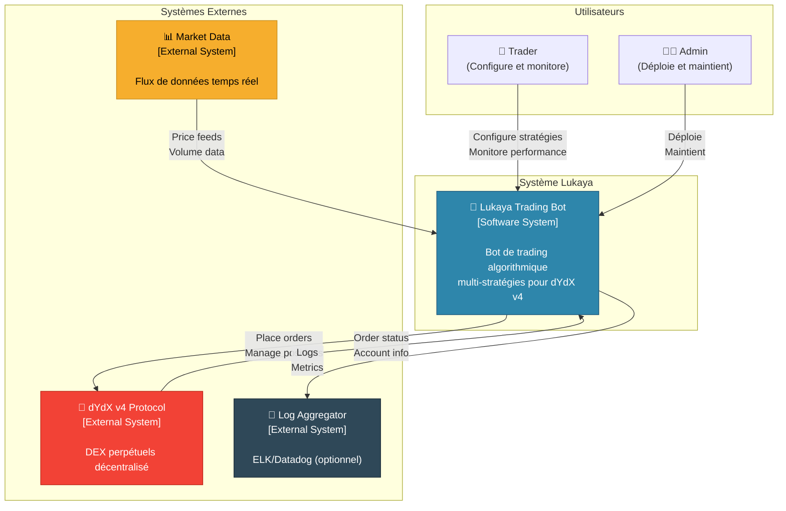

### Diagramme de Conteneurs (C4 Level 2)

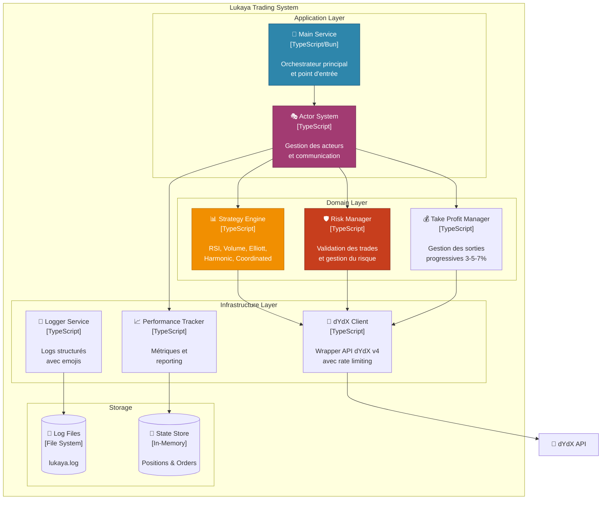

---

## 2. Architecture des Composants {#architecture-composants}

### Diagramme des Composants Principaux

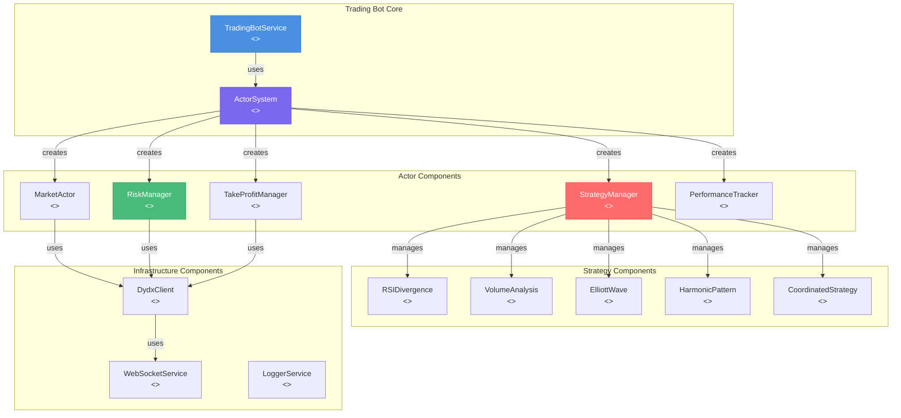

---

## 3. Flux de Données {#flux-donnees}

### Diagramme de Flux Principal

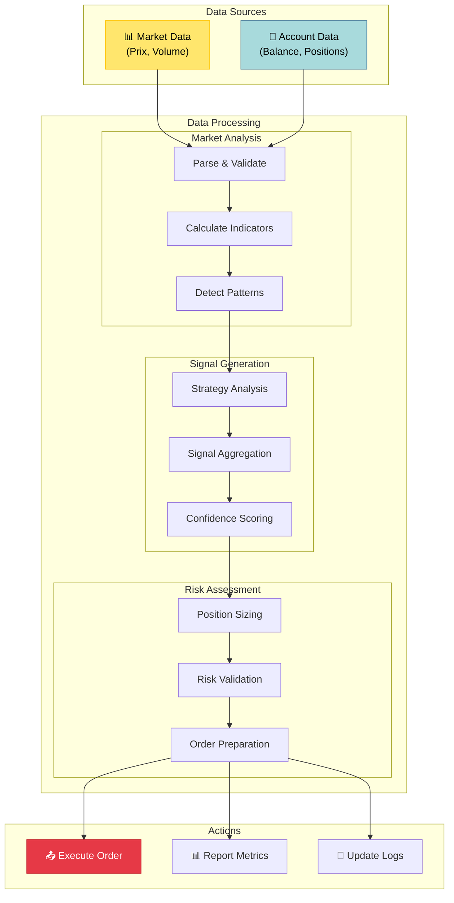

### Séquence de Trading Complète

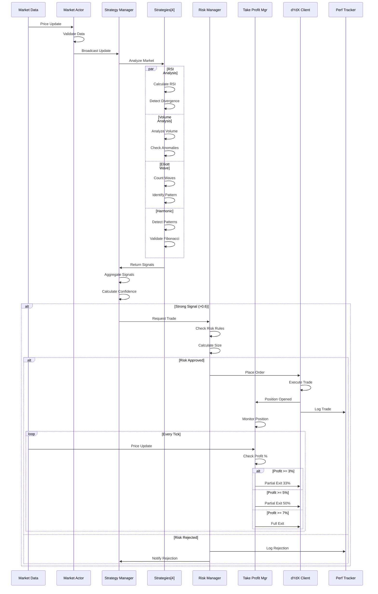

---

## 4. Système d'Acteurs {#systeme-acteurs}

### Hiérarchie des Acteurs

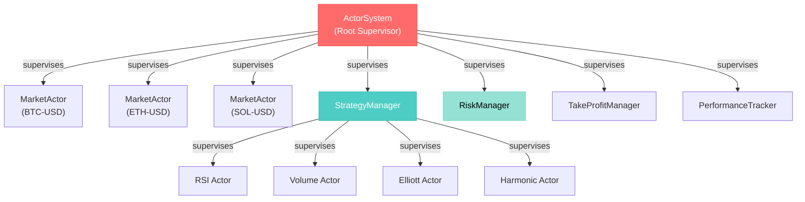

### Communication Inter-Acteurs

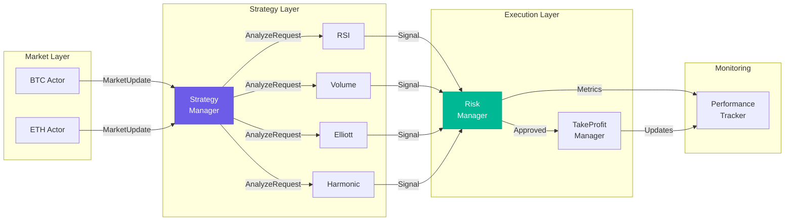

---

## 5. Stratégies de Trading {#strategies-trading}

### Architecture des Stratégies

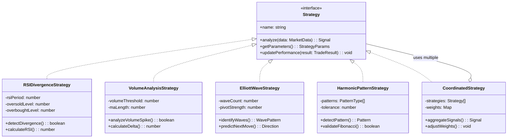

### Flux de Décision Stratégie Coordonnée

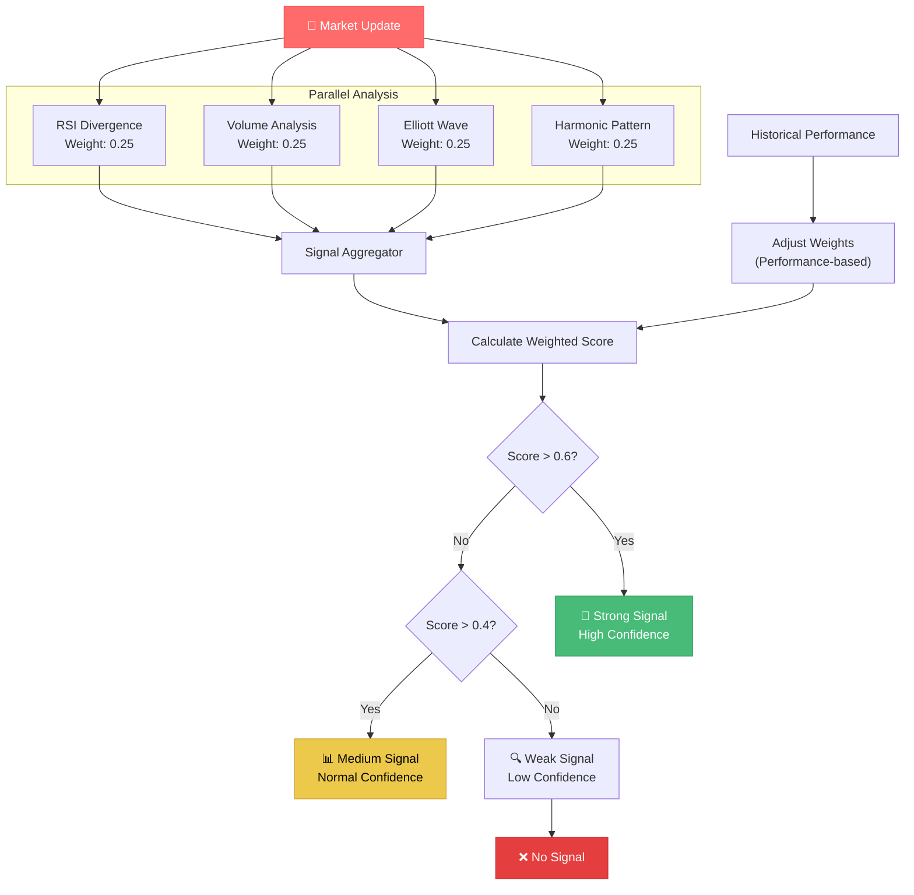

---

## 6. Gestion du Risque {#gestion-risque}

### Processus de Validation du Risque

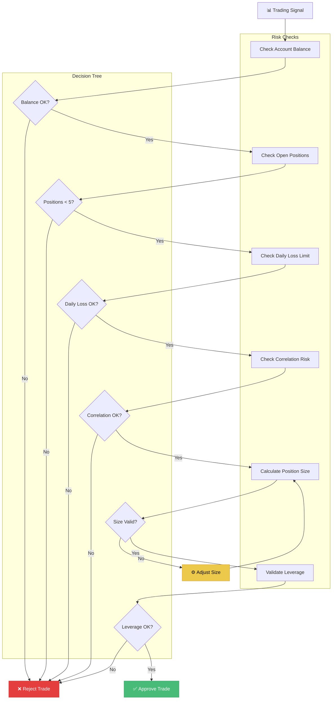

### Take Profit Strategy Flow

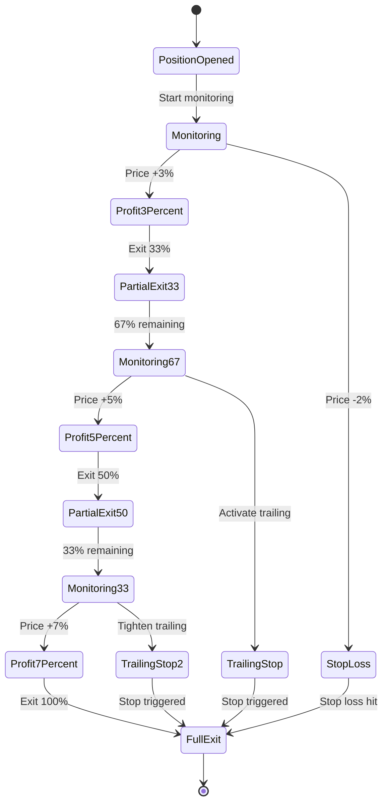

---

## 7. Cycle de Vie des Positions {#cycle-vie-positions}

### États d'une Position

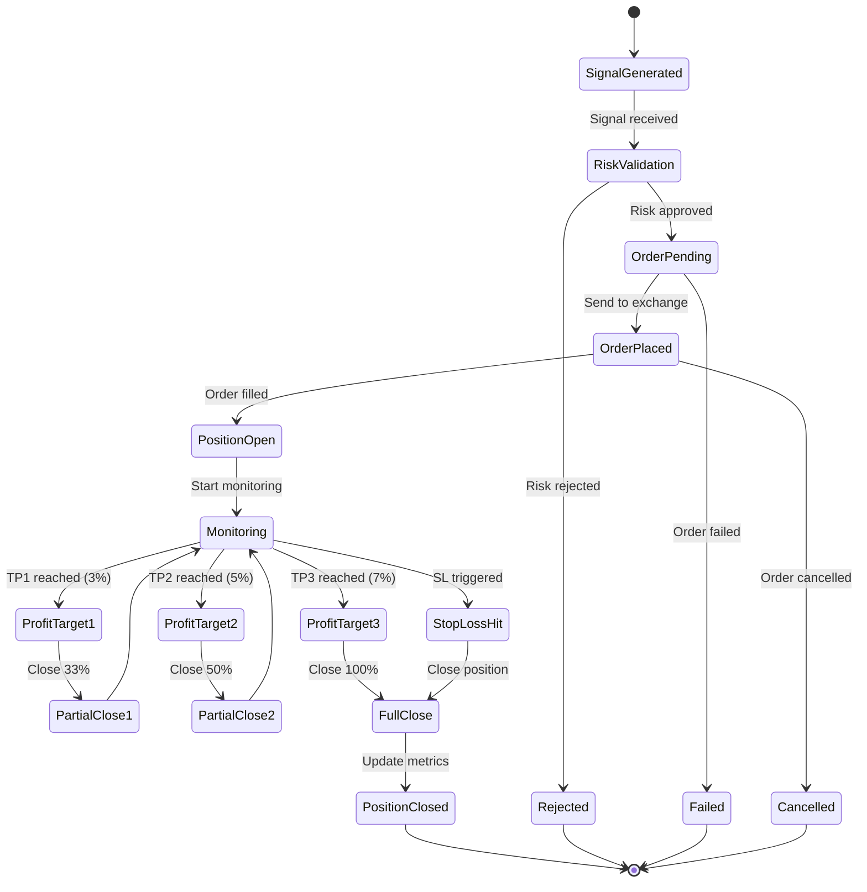

### Timeline d'une Position Type

```mermaid
gantt
    title Position Trading Timeline
    dateFormat HH:mm
    axisFormat %H:%M

    section Signal Phase
    Signal Detection          :done, signal, 09:00, 1m
    Strategy Analysis         :done, analysis, after signal, 2m
    Risk Validation          :done, risk, after analysis, 1m

    section Entry Phase
    Order Preparation        :done, prep, after risk, 30s
    Order Execution         :done, exec, after prep, 30s
    Position Opened         :milestone, after exec, 0m

    section Management Phase
    Initial Monitoring      :active, monitor1, after exec, 30m
    TP1 Reached (3%)       :milestone, after monitor1, 0m
    Partial Exit 33%       :done, exit1, after monitor1, 1m
    Continued Monitoring   :active, monitor2, after exit1, 45m
    TP2 Reached (5%)      :milestone, after monitor2, 0m
    Partial Exit 50%      :done, exit2, after monitor2, 1m
    Final Monitoring      :active, monitor3, after exit2, 20m
    TP3 Reached (7%)     :milestone, after monitor3, 0m
    Full Exit            :done, exit3, after monitor3, 1m

    section Reporting
    Update Metrics       :done, metrics, after exit3, 30s
    Log Performance     :done, logs, after metrics, 30s
```

---

## 8. Architecture de Déploiement {#architecture-deploiement}

### Diagramme de Déploiement

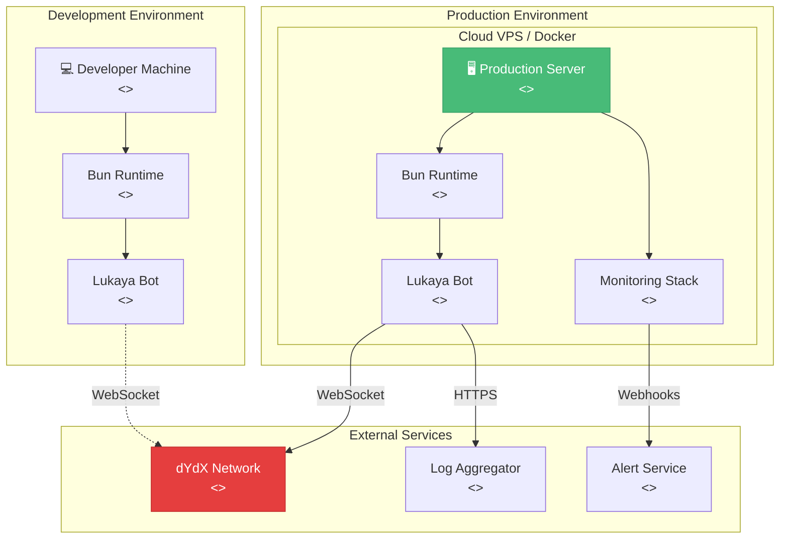

### Infrastructure as Code

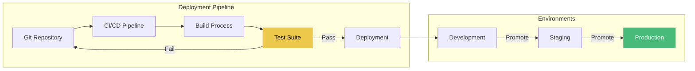

---

## 📋 Légende des Diagrammes

### Symboles Utilisés

- **🤖** : Composant automatisé
- **👤** : Acteur humain
- **📊** : Données/Métriques
- **🛡️** : Sécurité/Protection
- **💰** : Finance/Profit
- **⚡** : Action/Événement
- **📝** : Logs/Documentation
- **🔌** : Connexion/Interface

### Codes Couleur

- 🟦 **Bleu** : Composants principaux
- 🟩 **Vert** : Succès/Approbation
- 🟥 **Rouge** : Erreur/Rejet
- 🟨 **Jaune** : Avertissement/En cours
- 🟪 **Violet** : Acteurs/Services

---

*Ces diagrammes représentent l'architecture complète du système Lukaya Trading Bot. Pour plus de détails sur chaque composant, consultez la documentation technique correspondante.*
