# 📈 Diagrammes de Flux de Trading - Lukaya

Ce document détaille tous les flux de trading du système Lukaya avec des diagrammes visuels.

## Table des Matières

1. [Flux Principal de Trading](#flux-principal)
2. [Analyse de Marché](#analyse-marche)
3. [Génération de Signaux](#generation-signaux)
4. [Processus de Décision](#processus-decision)
5. [Exécution d'Ordres](#execution-ordres)
6. [Gestion des Positions](#gestion-positions)
7. [Flux de Take Profit](#flux-take-profit)
8. [Gestion des Erreurs](#gestion-erreurs)

---

## 1. Flux Principal de Trading {#flux-principal}

### Vue d'Ensemble du Processus Complet

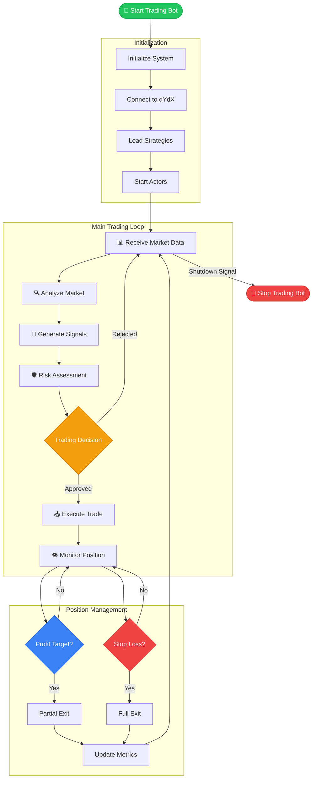

---

## 2. Analyse de Marché {#analyse-marche}

### Flux de Collecte et Traitement des Données

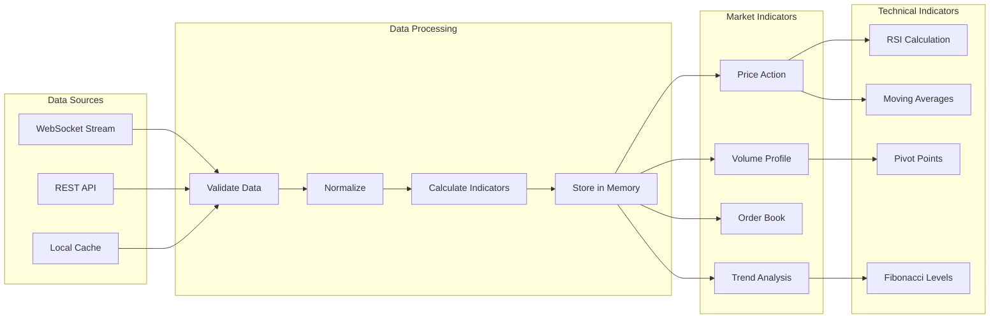

### Processus de Validation des Données

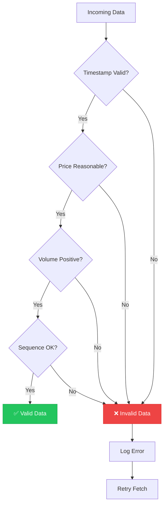

---

## 3. Génération de Signaux {#generation-signaux}

### Flux Multi-Stratégies

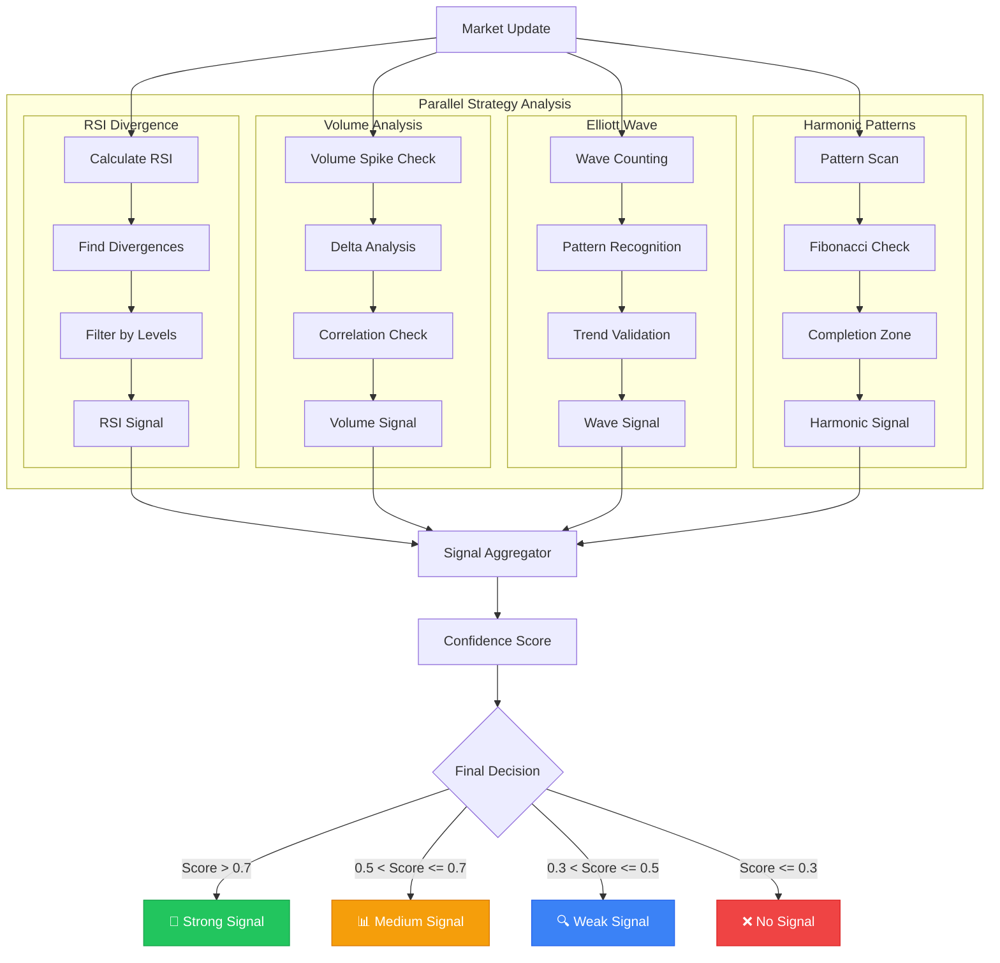

### Processus d'Agrégation des Signaux

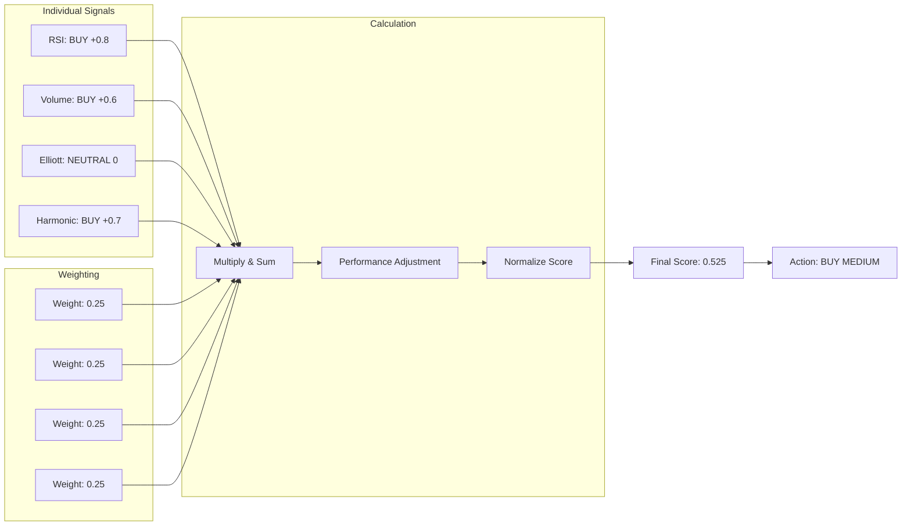

---

## 4. Processus de Décision {#processus-decision}

### Arbre de Décision de Trading

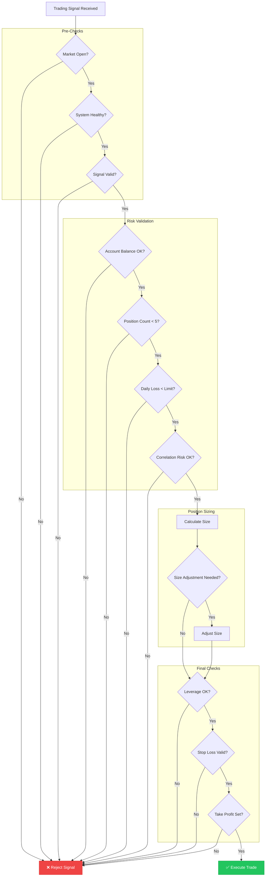

---

## 5. Exécution d'Ordres {#execution-ordres}

### Flux d'Exécution d'Ordre

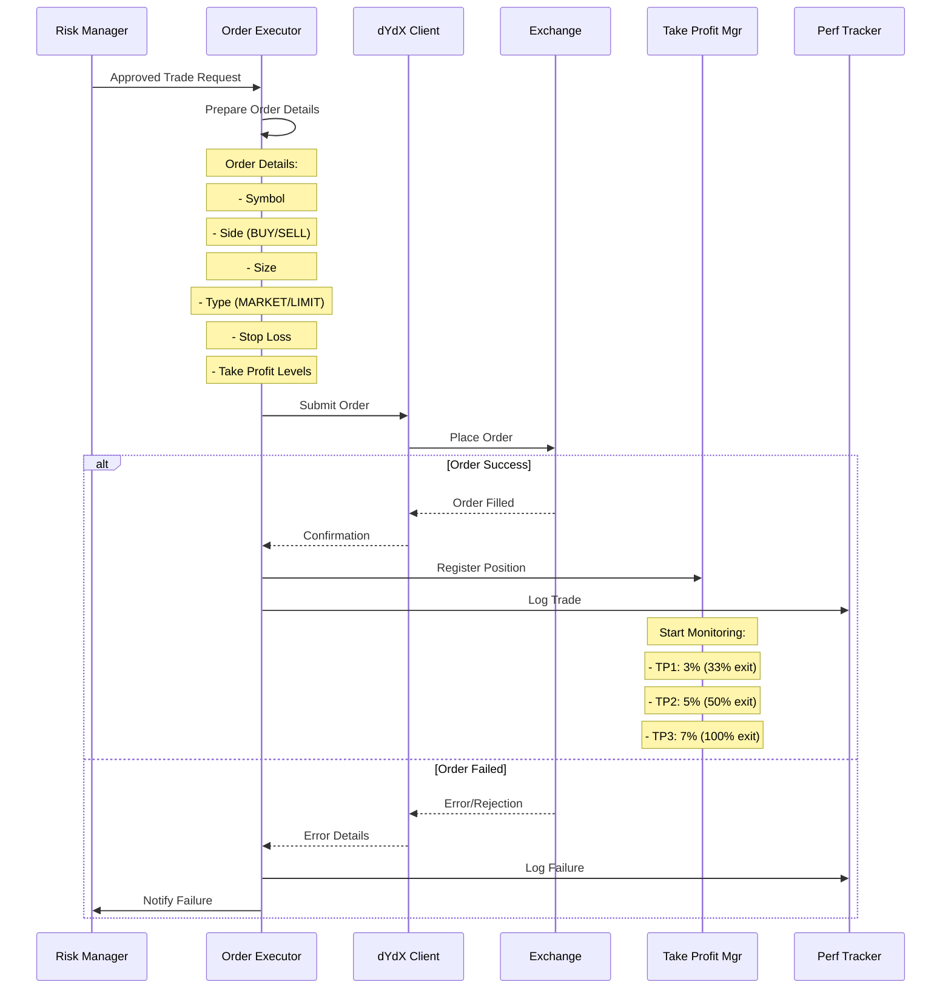

### Gestion des Types d'Ordres

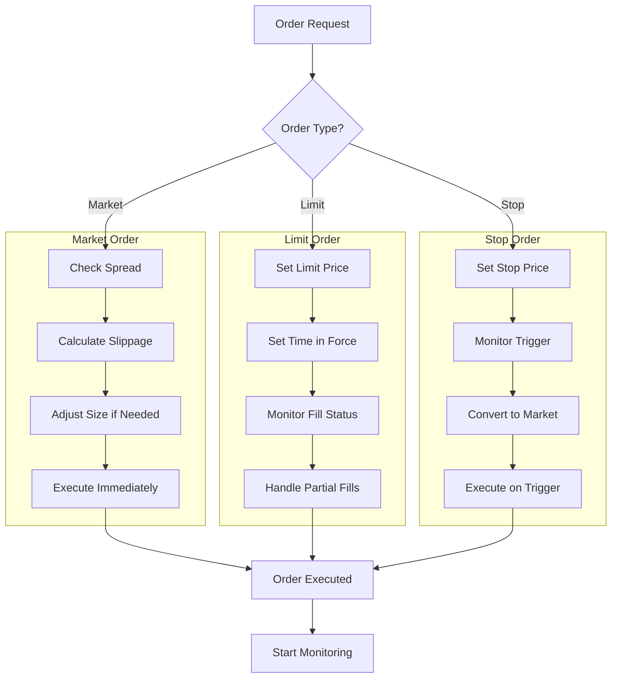

---

## 6. Gestion des Positions {#gestion-positions}

### Cycle de Vie d'une Position

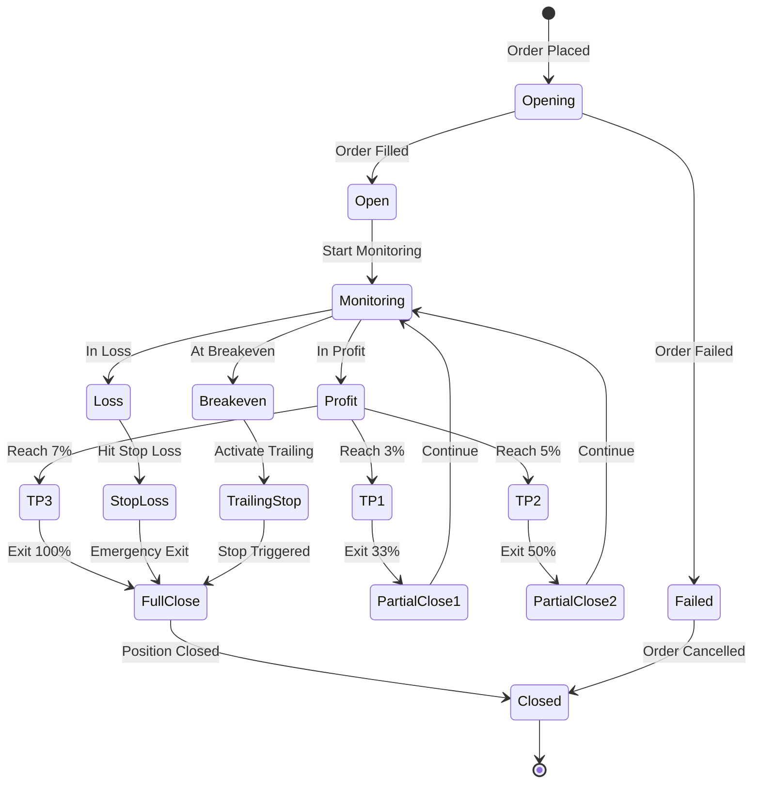

### Monitoring en Temps Réel

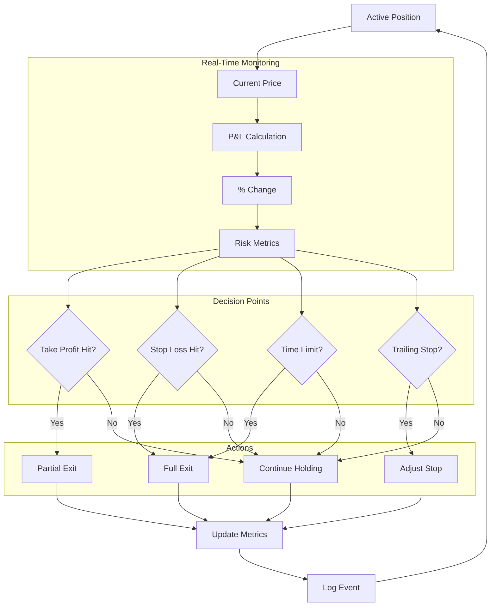

---

## 7. Flux de Take Profit {#flux-take-profit}

### Stratégie 3-5-7% en Détail

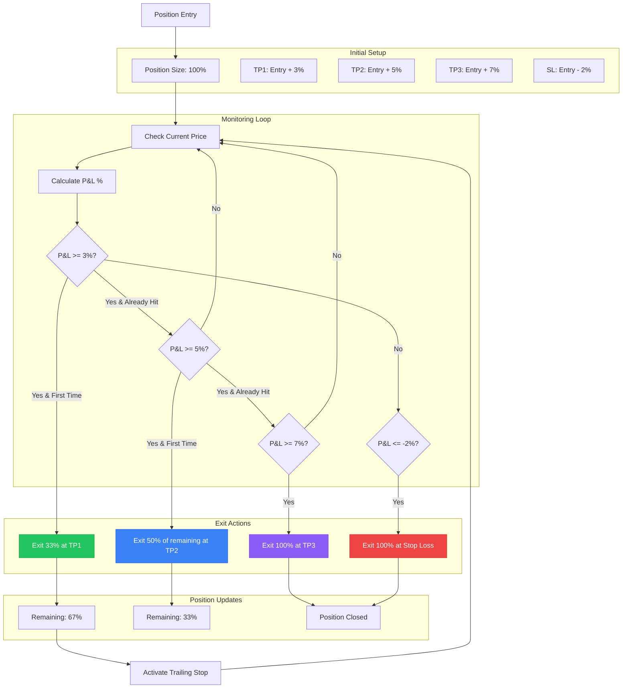

### Calcul des Sorties Progressives

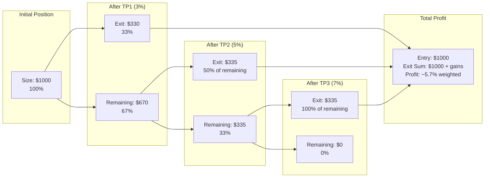

---

## 8. Gestion des Erreurs {#gestion-erreurs}

### Flux de Gestion d'Erreurs

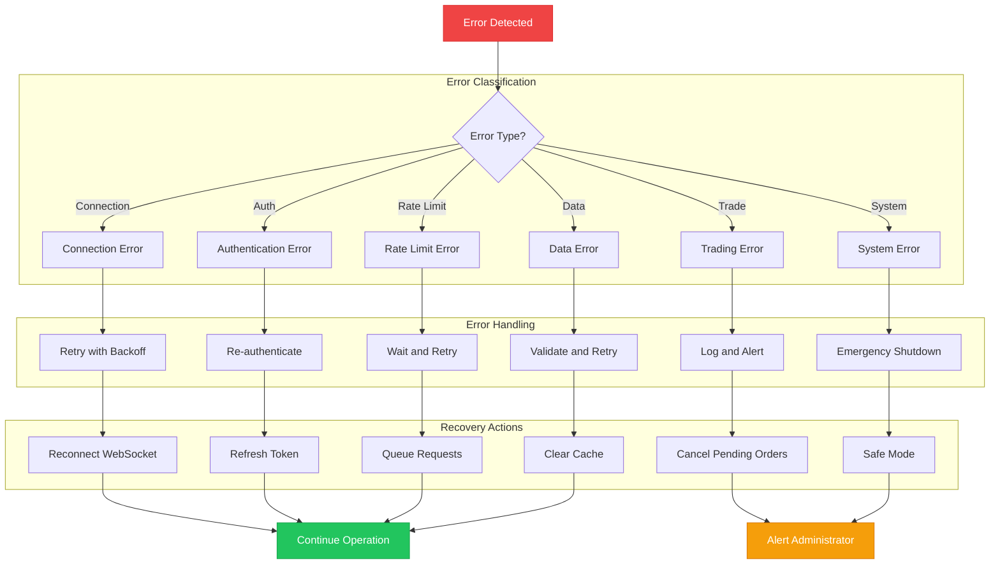

### Circuit Breaker Pattern

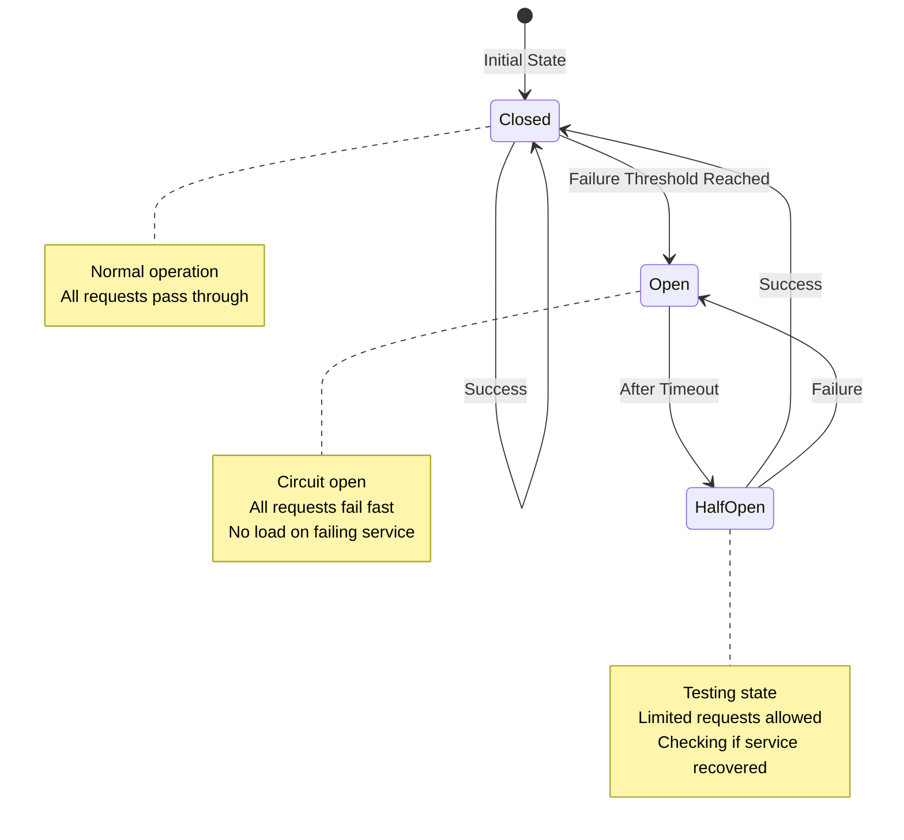

---

## 📊 Métriques et KPIs

### Flux de Collecte de Métriques

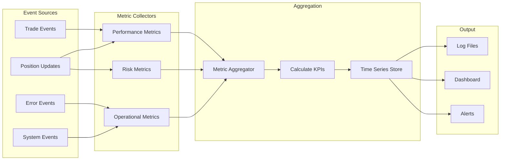

---

## 🔄 Flux de Récupération

### Processus de Récupération après Crash

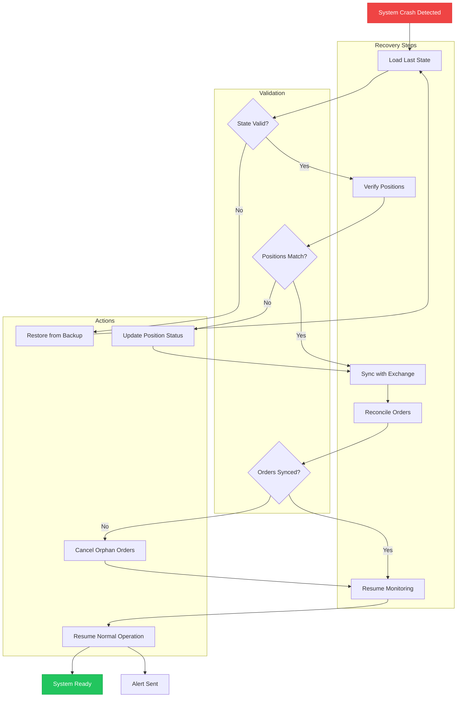

---

*Ces diagrammes représentent l'ensemble des flux de trading du système Lukaya. Chaque flux est conçu pour être robuste, scalable et facile à maintenir.*
